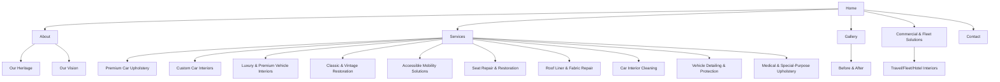
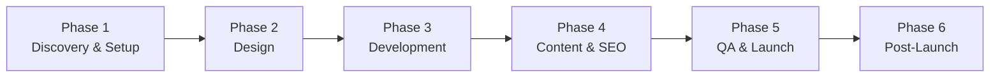

# Yousha Premium Auto Interiors — Website Development Report

2026-09-21 · Prepared by @Someone

## 1. Executive Summary

This report translates the client-supplied document "Yousha Premium Auto Interiors — Website Content Copy" into a complete, developer-and-designer-ready website project brief. It is meant to be the single reference a project team (designer, developer, SEO/content lead, project manager) uses to plan, design, build, and launch the site — nothing here requires guessing at intent from the raw copy deck.

**What the client gave us:** a 30-section content document covering brand basics, homepage copy, 20+ service/page narratives, FAQs, SEO metadata, and suggested taglines, with a note that visual design instructions were intentionally left minimal.

**What this report adds:** a recommended site architecture, a page-by-page functional and content blueprint, UX/design direction, a technical stack recommendation, an SEO execution plan, an asset checklist, a phased delivery roadmap, and a list of open questions the client should resolve before design starts.

**Top-line recommendations:**

- Build a \~13–16 page marketing/lead-generation website (not an e-commerce store) optimised for local SEO in Mumbai and for two distinct buyer journeys: individual/luxury car owners (B2C) and fleet/commercial/medical buyers (B2B).
- Treat **Accessible Mobility Solutions** as a flagship differentiator with its own dedicated page and visual treatment — it is the brand's most unique offering and a strong PR/SEO angle.
- Prioritise a strong **Gallery / Before-After** experience — this is a craftsmanship and restoration business; visual proof of work will convert more than copy will.
- Make **WhatsApp and phone contact** the primary conversion path (not just a form), matching how this audience actually books services in Mumbai.
- Launch with a lightweight CMS so the client's marketing/ops person can add gallery images, testimonials, and blog/SEO content without developer involvement.

## 2. Brand & Business Overview

**Brand name:** Yousha Premium Auto Interiors **Primary tagline:** "Three Generations of Craftsmanship. Reimagined for Modern Mobility." **Location:** Dainik Shivner Marg, Gandhi Nagar, Upper Worli, Worli, Mumbai, Maharashtra – 400018 **Contact:** +91 98194 78648 (Phone/WhatsApp) · info@yousha.in

**Heritage narrative (the emotional core of the brand):**

1. **1950s – Foundation:** Mr. Noor Bhai "Seatwale" (b. 1941) began as a self-taught upholstery craftsman, later recognised as a National Upholstery Tailor.
2. **1980s – Continuation:** His son, Mr. Sajid Akhter, carried the trade forward through decades of automotive seating, interior repair and upholstery work.
3. **Today – The Yousha Era:** The business is being reimagined as *Yousha Premium Auto Interiors*, named after the next generation. It is mentored by **Saqib Anjum** (engineer, cybersecurity consultant by profession) who brings modern process, digital presentation, accessibility focus and customer experience — while Mr. Sajid Akhter continues to lead on craftsmanship.

**Brand purpose:** Preserve multi-generational craftsmanship while modernising how automotive upholstery and interior services are delivered.

**Positioning:** A family-run, heritage automotive upholstery workshop repositioning itself as a premium, professional, accessibility-conscious interior brand — credible through decades of hands-on work, differentiated through modern presentation and a specialised accessibility line most competitors do not offer.

**Primary audience segments (design and content must serve all of these):**

- Private car owners needing seat repair/upholstery
- Luxury/premium car owners (Mercedes-Benz, BMW, Audi, Jaguar, Land Rover, Volvo, Lexus, Toyota, Škoda, Volkswagen, etc.)
- Classic/vintage car collectors seeking restoration
- Senior citizens and persons with mobility requirements (accessible seating)
- Corporate fleets, premium travel/chauffeur companies, hotels, tour operators
- Car dealers and used-car businesses
- Healthcare companies, clinics and rehabilitation centres (medical upholstery)

**Suggested tagline variants (for use across pages/campaigns):**

| Use case | Tagline |
| --- | --- |
| Primary / homepage | Three Generations of Craftsmanship. Reimagined for Modern Mobility. |
| Heritage / About page | A Legacy of Craftsmanship Since the 1950s. |
| Premium / Luxury page | Heritage in Craftsmanship. Luxury in Every Detail. |
| Accessibility page | Crafting Comfort. Creating Accessibility. |
| Vintage / Restoration page | Bespoke Automotive Interiors Since the 1950s. |

## 3. Goals & Success Metrics

**Business objectives for the website:**

- Generate qualified enquiries (calls, WhatsApp messages, quote-form submissions) from B2C customers across the service lines.
- Open a distinct, credible channel for B2B/fleet enquiries (travel companies, hotels, corporate fleets, dealers).
- Establish Yousha as a modern, trustworthy premium brand — overcoming the perception risk that a legacy "seatwale" business may look unprofessional online.
- Rank locally for high-intent Mumbai search terms (car upholstery, seat repair, luxury interior restoration, accessible car seats).
- Showcase craftsmanship visually (gallery, before/after) to build trust ahead of first contact.
- Educate the market on the accessibility seating line, which is likely unfamiliar to most visitors.

**Suggested KPIs to track post-launch:**

| Metric | Target signal |
| --- | --- |
| WhatsApp/Call clicks | Primary conversion — track via click events on tel:/wa.me links |
| Quote-form submissions | Secondary conversion for B2B and complex jobs |
| Organic sessions from Mumbai/Maharashtra | Local SEO health |
| Ranking for target keyword themes (Section 14) | SEO progress |
| Gallery/Before-After page engagement (time on page, scroll depth) | Trust-building content performing |
| Bounce rate on service pages | Content-market fit per service line |
| Mobile conversion rate | Majority of local searches will be mobile |

**Definition of done for launch:** all 30 content sections mapped to a live page/section, WhatsApp and call CTAs functional on every page, gallery populated with real photography, mobile responsive, SEO metadata implemented, and forms tested end-to-end (submission + notification to client).

## 4. Recommended Site Architecture / Sitemap

The client's "Recommended Menu" (Home | About | Services | Luxury Interiors | Accessible Seating | Vintage Restoration | Commercial Solutions | Gallery | Contact) is a good starting nav, but the content document actually contains \~20 distinct service/topic narratives. Recommendation: keep the **top navigation shallow** (7–8 items) and nest the remaining service detail under a **Services mega-menu / dropdown**, with each service also getting its own indexable URL for SEO.



**Proposed top navigation (8 items):** Home · About · Services · Accessible Seating · Luxury & Restoration · Commercial Solutions · Gallery · Contact

**Full page list with suggested URLs:**

| # | Page | URL slug |
| --- | --- | --- |
| 1 | Homepage | / |
| 2 | About Us (incl. Heritage, Vision, Message from the Family) | /about |
| 3 | Services (hub/overview) | /services |
| 4 | Premium Car Upholstery | /services/car-upholstery |
| 5 | Custom Car Interiors | /services/custom-interiors |
| 6 | Luxury & Premium Vehicle Interiors | /services/luxury-car-interiors |
| 7 | Classic & Vintage Restoration | /services/vintage-car-restoration |
| 8 | Accessible Mobility Solutions | /accessible-seating |
| 9 | Seat Repair & Restoration | /services/seat-repair |
| 10 | Roof Liner & Interior Fabric Repair | /services/roof-liner-repair |
| 11 | Car Interior Cleaning | /services/interior-cleaning |
| 12 | Vehicle Detailing & Protection | /services/detailing |
| 13 | Commercial & Fleet / Travel Solutions | /commercial-solutions |
| 14 | Medical & Special-Purpose Upholstery | /medical-upholstery |
| 15 | Gallery (with Before & After tab/filter) | /gallery |
| 16 | FAQ | /faq (or accordion on relevant pages) |
| 17 | Contact | /contact |

**Note:** "Other Custom Upholstery Projects" (Section 16) has no dedicated page in the source — recommend folding it into the Services hub page and the Medical Upholstery page as a closing "custom project" callout, rather than a standalone page (see Section 17, Open Questions).

## 5. Page Blueprint — Homepage, About, Heritage, What We Do

### Homepage (/)

1. **Hero** — H1: "Three Generations of Craftsmanship. Reimagined for Modern Mobility." Sub-copy from Hero Copy block. Two CTAs: *Explore Our Services* (→ /services) and *Get a Custom Quote* (→ quote form/contact). Trust line under CTAs: "Since the 1950s • Three Generations • Mumbai." Hero should carry a strong image/video of finished premium interior work (not stock photography).
2. **Trust/heritage strip** — short version of the three-generation story with a link to full About/Heritage page.
3. **What We Do overview** — "Complete Automotive Interior Solutions" intro copy, then a grid of service cards (icon + short label) linking to each service page: Upholstery, Custom Interiors, Luxury, Vintage, Accessible Seating, Repair, Roof Liner, Cleaning, Detailing, Commercial, Medical.
4. **Accessible Mobility Solutions callout** — a distinct, visually separated band promoting this as a specialised offering (differentiator), linking to /accessible-seating.
5. **Why Yousha** — condensed version of Section 17 (badges/icons: 70+ years experience, custom-made, luxury capable, accessibility-focused, B2C & B2B).
6. **Our Process** — 6-step horizontal/vertical process strip (Understand → Inspect → Design & Select → Execute → Quality Check → Delivery).
7. **Gallery teaser** — 3–6 image preview grid, CTA "View Our Work" → /gallery.
8. **Who We Serve** — logo-style/icon strip of segments (private owners, luxury owners, collectors, seniors/accessibility, fleets, hotels, dealers, healthcare).
9. **Vehicles We Work With** — simple tag/badge list (Hatchbacks, Sedans, SUVs, Luxury, Vintage, Vans, Commercial, Travel, Special-Purpose).
10. **Final CTA band** — Section 30 copy: "Your Car Deserves More Than a Standard Interior... Let's Create Your Interior." with Call/WhatsApp/Email.
11. **Footer** — per Section 27.

### About Page (/about)

Combines Sections 2, 3, 20, 21:

- H2 "A Legacy Built Since the 1950s" + full narrative (Noor Bhai → Sajid Akhter → Saqib Anjum / Yousha era).
- **Our Heritage** timeline (Section 3): three cards/timeline stops — 1950s Foundation, 1980s Craft Continues, Today The Yousha Era — closing line "Heritage remains our foundation. Innovation defines our future."
- **Our Vision** (Section 20): bullet list of vision pillars + closing aspirational statement.
- **Message from the Family** (Section 21): quote-style block attributed to — Saqib Anjum, Mentor, Yousha Premium Auto Interiors. Treat as a pull-quote/testimonial-style module with a portrait photo if available.
- Brand Purpose statement as a highlighted callout.

### What We Do (Section 4)

Can live as the intro block of the /services hub page rather than a standalone page: short framing copy positioning Yousha as a one-stop shop for seating/upholstery/comfort/interiors, then routes into the service grid described in Section 4 of this report.

## 6. Page Blueprint — Core Service Pages

Each service page should follow one consistent template: H1/H2 headline → intro paragraph → bullet list of offerings → relevant gallery images → CTA (Get a Quote / WhatsApp). Content source sections mapped below.

### Premium Car Upholstery (Section 5) — /services/car-upholstery

H2 "Customised Around Your Vehicle." 13 offerings: premium seat upholstery, custom seat-cover manufacturing, leather/leatherette interiors, fabric upholstery, perforated/quilted patterns, dual-tone designs, seat cushioning/foam restoration, seat reshaping, door-pad upholstery, armrest upholstery, centre-console finishing, steering-wheel wrapping, gear-knob/trim finishing. Display as a two-column checklist or icon grid, not a plain bullet wall.

### Custom Car Interiors (Section 6) — /services/custom-interiors

H2 "Designed Around You." Emphasise personalisation (materials, textures, stitching, cushioning per customer). Customisation options (10 items: materials, custom stitching, diamond quilting, perforated finishes, contrast piping, embossed designs, comfort padding, colour combinations, factory-style restoration, personalised design concepts) work well as a visual "build your interior" style selector/swatch grid if budget allows, otherwise a clean bullet grid.

### Luxury & Premium Vehicle Interiors (Section 7) — /services/luxury-car-interiors

H2 "Specialised Care for Premium Cars." **Important:** list of brand names (Mercedes-Benz, BMW, Audi, Jaguar, Land Rover, Volvo, Lexus, Toyota, Škoda, Volkswagen) must carry the developer note disclaimer — presented as "experience working on interiors across models from brands such as..." not as an authorised/affiliated dealer, and must NOT use brand logos without legal clearance. 10 service items (seat leather restoration, upholstery replacement, roof-liner replacement, sagging roof repair, door-panel upholstery, interior leather repair, seat cushioning restoration, interior trim refurbishment, steering/console upholstery, custom comfort enhancement). Closing line on preserving vehicle character.

### Classic & Vintage Car Restoration (Section 8) — /services/vintage-car-restoration

H2 "Respecting the Original Character." Position as heritage-driven, not mass-production. 8 items (vintage seat restoration, classic upholstery recreation, foam/cushioning rebuild, roof-liner restoration, door-panel restoration, carpet/trim work, custom material matching, interior refurbishment). This page pairs especially well with strong before/after photography and the brand's own multi-generational story — cross-link to /about.

### Seat Repair & Restoration (Section 10) — /services/seat-repair

H2 "Repair Before You Replace." Positions Yousha as advisor-first (inspect → recommend repair vs. replace). 11 damage types covered (torn upholstery, cracked leather, damaged stitching, worn surfaces, collapsed cushioning, uneven foam, damaged bolsters, seat base restoration, headrest upholstery, armrest repair, interior trim damage). Good candidate for an interactive "select your issue" UI component.

### Roof Liner & Interior Fabric Repair (Section 11) — /services/roof-liner-repair

H2 "Bring Back the Factory-Fresh Interior." 6 items (sagging roof-liner replacement, roof-fabric replacement, pillar upholstery, sunroof surrounding fabric work, door-fabric replacement, interior fabric restoration).

### Car Interior Cleaning (Section 12) — /services/interior-cleaning

H2 "Professional Interior Care at Your Doorstep." Flag doorstep availability as *service-area dependent* ("subject to service availability"). 8 items (seat cleaning, vacuuming, carpet/roof/door-pad/dashboard cleaning, interior detailing, leather cleaning & conditioning). Closing line: "Convenient. Professional. Delivered to your doorstep."

### Vehicle Detailing & Protection (Section 13) — /services/detailing

Framed as a *planned/complementary* service ("Yousha also plans to provide...") — recommend a subtle "Coming Soon" or "Ask us about availability" tag rather than presenting as fully live, since copy explicitly says availability may vary by vehicle condition and location. 7 items (Teflon coating, exterior polishing, interior detailing, leather conditioning, plastic/trim restoration, paint enhancement, basic protection packages).

## 7. Page Blueprint — Accessible Mobility Solutions (Flagship Page)

**URL:** /accessible-seating · **Source:** Section 9

This is the brand's strongest differentiator and deserves the richest design treatment on the site — not a standard service-card layout.

**Structure:**

1. H2 "Making Cars More Accessible" + intro copy on dignity, comfort and accessibility, and the individual-evaluation philosophy.
2. **Five solution modules**, each as its own card/section with icon + heading + description:
   - **Swivel Seats** — seats designed/modified to rotate towards the door for easier entry/exit.
   - **Transfer-Friendly Seating** — reduces difficulty transferring between wheelchair and vehicle seat.
   - **Seat Extension & Positioning Solutions** — custom fabrication based on comfort/mobility needs.
   - **Comfort Modifications** — additional cushioning/positioning support.
   - **Custom Mobility Projects** — bespoke evaluation when no standard solution fits.
3. **Accessibility Philosophy** pull-quote: "Accessibility is not about making every vehicle identical. It is about understanding the individual and creating a solution around them."
4. **Safety/feasibility disclaimer** (from the source document's developer note): all accessibility modifications must be presented as evaluated per vehicle, passenger requirement, feasibility and safety — this should appear as a visible notice on this page, not buried in a footer, both for legal clarity and for genuine user trust (echoed in FAQ: "Not necessarily... vehicle structure, seat configuration, available space, passenger requirement and safety must first be evaluated.").
5. **Dedicated enquiry path**: consider a slightly different quote form on this page (fields: vehicle make/model, mobility requirement, current seating challenge) since these are consultative sales, not off-the-shelf purchases.
6. Cross-link to relevant FAQ entries (Section 25: "Do you provide accessibility modifications?", "Can accessibility solutions be fitted in every vehicle?").

**Design note:** use real, respectful photography/illustration — avoid generic stock imagery of disability. If no real project photography exists yet, use descriptive icon-based illustration instead of stock photos (see Section 15, Asset Requirements).

## 8. Page Blueprint — Commercial, Medical & Other Custom Work

### Commercial & Travel/Fleet Solutions (Section 14) — /commercial-solutions

H2 "Upgrade the Passenger Experience." Targets premium travel companies, corporate transport, hotels, tour operators, chauffeur services. Vehicle categories served (9 items: luxury travel vehicles, premium taxis, corporate cars, chauffeur fleets, tourist vehicles, tempo travellers, premium vans, VIP transport, hotel fleets). Services: premium seating, custom upholstery, cushioning, refurbishment, fleet restoration. **B2B CTA:** "We welcome single-vehicle customisation as well as multi-vehicle interior projects" → button "Discuss a Commercial Project." Recommend a distinct, slightly more formal/corporate visual tone here (fewer emotional/heritage cues, more capability/capacity/process cues) and a form that captures fleet size and vehicle types.

### Medical & Special-Purpose Upholstery (Section 15) — /medical-upholstery

H2 "Upholstery Beyond Automobiles." Targets healthcare/allied industries: examination tables, medical couches, patient seating, rehabilitation equipment, paramedical equipment, therapy tables, clinic seating, custom foam/upholstered components. Note: "Projects can be undertaken based on dimensions, material requirements and application" — a simple project-brief form (dimensions, material, application, quantity) fits well here.

### Other Custom Upholstery Projects (Section 16)

Short, open-ended pitch ("Have something unusual?... If it involves seating, cushioning, upholstery or interior comfort, talk to us."). Recommend using this as a **closing module** on both the Services hub page and the Medical Upholstery page rather than its own thin page — it reads as a catch-all invitation, not a distinct service line, and a standalone page would likely be too sparse for SEO value.

## 9. Page Blueprint — Why Yousha, Our Process, Vehicles We Work With

*(Vision and Message from the Family are placed on /about in Section 5 above — cross-referenced here, not duplicated.)*

### Why Yousha (Section 17)

Best used as a **reusable module** appearing on the homepage (condensed) and in full on /about. 9 differentiators, each with a short label + one-line explanation: Over Seven Decades of Family Experience; Premium Workmanship; Custom-Made Solutions; Luxury Vehicle Experience; Accessibility-Focused; Repair, Restore or Upgrade; Multiple Material Choices; B2C & B2B; Modern Customer Experience. Recommend an icon-grid layout (3×3) rather than a long bullet list.

### Our Process (Section 18)

H2 "From Requirement to Finished Interior." A clean 6-step horizontal stepper works well on the homepage and can repeat (or link) on individual service pages: 01 Understand → 02 Inspect → 03 Design & Select → 04 Execute → 05 Quality Check → 06 Delivery. Each step already has a one-line description in the source content — use verbatim.

### Vehicles We Work With (Section 19)

Simple tag/badge strip, best placed on homepage and Services hub as a trust signal: Hatchbacks • Sedans • SUVs • Luxury Cars • Vintage Cars • Premium Vans • Commercial Vehicles • Travel Vehicles • Special-Purpose Vehicles. No dedicated page needed.

## 10. Page Blueprint — Gallery, Before/After, Who We Serve, FAQ, Contact, Footer

### Gallery (/gallery) — Sections 22 & 23

H2 "Crafted with Attention to Every Detail." Filterable image gallery by category (10 filters from source): Premium Interiors, Luxury Cars, Seat Restoration, Custom Upholstery, Vintage Cars, Roof-Liner Work, Accessible Seating, Before & After, Commercial & Travel Vehicles, Special Projects. **Before & After** should be a first-class filter/tab within Gallery (not a separate page) using a slider or side-by-side comparison component (H2 "See the Transformation"; CTA "View Our Work"). This is likely the single highest-converting content asset on the site — prioritise real project photography here above all other imagery (see Section 15).

### Who We Serve (Section 24)

Best as a segmented list/icon strip on the homepage and/or About page: Private Car Owners, Luxury Car Owners, Classic & Vintage Collectors, Senior Citizens, Persons with Mobility Requirements, Corporate Fleets, Premium Travel Companies, Hotels & Hospitality, Tour Operators, Car Dealers, Used-Car Businesses, Healthcare Companies, Clinics & Rehabilitation Centres.

### FAQ (Section 25)

9 Q&As, ideal as an accordion component. Recommend surfacing on /faq **and** repeating the most relevant 2–3 questions inline on the matching service page (e.g. accessibility Q&As on /accessible-seating, vintage Q&A on /services/vintage-car-restoration) for SEO (FAQ schema) and conversion context:

1. Can you customise a seat design based on my requirement? — Yes.
2. Do you work on luxury cars? — Yes.
3. Can you repair only one damaged section? — Where technically practical, yes.
4. Do you restore vintage-car interiors? — Yes, evaluated individually.
5. Do you provide accessibility modifications? — Yes, core focus area.
6. Can accessibility solutions be fitted in every vehicle? — Not necessarily; requires evaluation.
7. Do you undertake fleet work? — Yes.
8. Do you provide doorstep services? — Selected services, availability-dependent.
9. Do you undertake non-automotive upholstery? — Yes, selected medical/paramedical work.

### Contact (/contact) — Section 26

H2 "Your Interior. Your Comfort. Your Style." Full address, email, phone/WhatsApp. Four CTAs: Call Us, WhatsApp Us, Get a Quote, Visit Our Workshop (→ embedded Google Map). Include a quote-request form (see Section 11, Functional Requirements) alongside the direct-contact CTAs, since some segments (B2B, medical, accessibility) need to describe a requirement rather than just call.

### Footer (Section 27) — site-wide

Brand name, service tagline line, "Since the 1950s | Three Generations of Craftsmanship," location line, copyright. Add (not in source but standard practice): sitemap/quick links, social icons if applicable, and the brand-affiliation disclaimer in small print if the Luxury page names third-party brands.

## 11. Functional & Feature Requirements

| Feature | Requirement |
| --- | --- |
| Click-to-call | `tel:+919819478648` link on header, footer, contact page and every service page's CTA |
| WhatsApp integration | `wa.me/919819478648` deep link (optionally pre-filled message per page, e.g. "Hi, I'm interested in Accessible Seating") on header/footer and every page CTA; floating WhatsApp button site-wide is recommended for this audience |
| Quote request form | Fields: name, phone, email, vehicle make/model, service interested in (dropdown mapped to the 10 service pages), message/description, optional photo upload of the damaged/target seat or interior |
| Commercial/B2B enquiry form | Separate or extended form on /commercial-solutions: company name, fleet size, vehicle types, service required |
| Medical/special-purpose enquiry form | On /medical-upholstery: application type, dimensions, material requirement, quantity |
| Gallery filtering | Category filter (10 categories) + lightbox viewer; lazy-loaded images for performance |
| Before/After comparison | Slider or side-by-side component, reusable across gallery and service pages |
| FAQ accordion | Expand/collapse, with FAQ schema markup for SEO |
| Map embed | Google Maps embed on Contact page for "Visit Our Workshop" |
| Form notifications | Submissions routed to info@yousha.in and/or WhatsApp Business API/notification; auto-reply confirmation to the customer |
| CMS / admin | Client should be able to independently: add/edit gallery images and before/after pairs, add testimonials (not present in source content — flagged as a gap in Section 17), update FAQ, edit basic page text — without developer involvement |
| Analytics | Google Analytics 4 + Google Search Console from day one; event tracking on all call/WhatsApp/form CTAs |
| Multi-language | Not requested in source content; flagged as an open question (Section 17) given the Mumbai/Marathi-Hindi-English market |

**Not required:** e-commerce/checkout, user accounts/login, online payments — nothing in the source content indicates products are sold directly online; this is a lead-generation and portfolio site.

## 12. Design & UX Guidelines

The source document explicitly leaves visual direction minimal, so this section sets a recommended direction rather than a mandate — confirm with the client before finalising.

**Visual tone:** Premium-but-warm. The brand sits between "heritage craftsman" and "modern premium automotive." Avoid a cold, purely corporate look (undercuts the family-heritage story) and avoid a low-budget local-workshop look (undercuts the "premium" positioning). Reference points: premium automotive brand microsites, artisan/craft brand sites (leather goods, bespoke tailoring) for texture and materiality cues.

**Colour & typography direction (to validate with client/brand assets):**

- Deep, rich base tones (charcoal, deep brown/tan, or deep navy) evoking leather and automotive interiors, with a warm accent (amber/gold or burnished copper) for CTAs — avoid bright/generic "tech startup" palettes.
- A confident serif or semi-serif for headings (craftsmanship, heritage) paired with a clean sans-serif for body copy (modern readability).
- No existing logo or brand guideline was included in the source — flagged in Section 17 as an open item.

**Imagery style:** Real photography of actual vehicles, workshop, craftsmen at work, and finished interiors should dominate over stock photography or illustration — this is a trust-driven, craftsmanship business. Where real photography isn't yet available for a section (e.g. accessible seating), use tasteful line-art/icon illustration rather than generic stock.

**Layout patterns to use throughout:**

- Consistent service-page template (hero → intro → offering list/grid → gallery → CTA) so the \~10 service pages feel like one system, not ad hoc pages.
- Icon + short-label grids for list-heavy content (Why Yousha, customisation options, vehicle types) instead of long bullet walls.
- Timeline/stepper components for Heritage and Our Process.
- Sticky/floating call + WhatsApp buttons on mobile.

**Responsive/mobile:** Design mobile-first. Given the target audience (calling from a phone while looking at their car, or searching "car seat repair near me"), mobile conversion paths (tap-to-call, tap-to-WhatsApp) must be one tap from any page, not buried in a menu.

**Accessibility (WCAG):** Given the brand's own accessibility-seating service line, the website itself should meet WCAG 2.1 AA at minimum — sufficient colour contrast, alt text on all images (especially gallery/before-after), keyboard-navigable forms and accordions, and readable font sizes. This is both a genuine best practice and a credibility point given the accessible-seating service.

## 13. Technical Stack Recommendations

Given this is a content-driven, marketing/lead-gen site (no e-commerce, no user accounts), a lightweight, easily-maintained stack is preferable to a heavy custom build.

| Layer | Recommended option | Why |
| --- | --- | --- |
| CMS/Framework | WordPress (with a modern block theme) or a headless CMS (e.g. Sanity/Contentful) + Next.js | WordPress: fastest to hand off to a non-technical client for gallery/FAQ updates. Headless + Next.js: better performance/SEO if budget allows and a developer will maintain it long-term |
| Hosting | Managed WordPress hosting (e.g. SiteGround/Kinsey-class) or Vercel/Netlify (if headless) | Reliability and easy SSL/CDN without deep DevOps involvement |
| Forms | WPForms/Fluent Forms (WordPress) or a form service (Formspree/Getform) if headless | Needs file-upload support for the quote form's optional photo attachment |
| Gallery/Before-After | A dedicated gallery plugin/component with lightbox + comparison slider (e.g. "Before After Slider" pattern) | Central to conversion — don't rely on a generic image grid |
| WhatsApp | wa.me deep links; consider WhatsApp Business API integration later for automated quote-request routing | Matches the target audience's actual contact behaviour |
| Performance | Image optimisation/lazy-loading (WebP/AVIF), CDN, target Core Web Vitals "Good" thresholds | Gallery-heavy site risks slow load without this |
| Security | SSL (HTTPS) everywhere, regular backups, spam protection (reCAPTCHA) on all forms | Standard baseline |
| Maps | Google Maps embed (Contact page) | For "Visit Our Workshop" |
| Analytics/SEO tooling | Google Analytics 4, Google Search Console, Google Business Profile (critical for local SEO — not a website task but should be scoped alongside launch), Yoast/RankMath if WordPress | Local SEO is a stated priority (Section 3) |

**Recommendation:** Unless the client has a specific technical preference or existing infrastructure, WordPress is the pragmatic choice here — it balances launch speed, cost, and the client's stated need to manage gallery/content without ongoing developer dependency. Confirm this choice with the client before development starts (see Open Questions, Section 17).

## 14. SEO Strategy

**Homepage SEO title (from source, Section 29):** "Yousha Premium Auto Interiors | Car Upholstery & Luxury Car Interiors Mumbai"

**Meta description (from source):** "Yousha Premium Auto Interiors brings three generations of upholstery experience to premium car interiors, custom seat upholstery, luxury and vintage-car restoration, roof-liner repair, accessible swivel seating and specialised upholstery solutions in Mumbai."

**Keyword themes (from source — map one primary theme per page, don't cram all on homepage):**

| Keyword theme | Best-fit page |
| --- | --- |
| Car upholstery Mumbai / Premium car interiors Mumbai | Homepage, /services/car-upholstery |
| Luxury car upholstery Mumbai / BMW, Mercedes interior repair Mumbai | /services/luxury-car-interiors |
| Car seat repair Mumbai | /services/seat-repair |
| Car roof liner repair Mumbai | /services/roof-liner-repair |
| Car seat customisation Mumbai / Custom leather car seats Mumbai | /services/custom-interiors |
| Vintage car upholstery Mumbai / Classic car interior restoration Mumbai | /services/vintage-car-restoration |
| Accessible car seat Mumbai / Swivel car seat Mumbai | /accessible-seating |
| Car interior restoration Mumbai | /gallery (Before & After) |

**On-page SEO plan:**

- Unique title tag + meta description per page (each service page should have its own, following the homepage pattern — not yet supplied in source for sub-pages, needs to be written during build).
- H1 per page = the page's headline from this blueprint; keyword-relevant H2s for each major section.
- Descriptive, keyword-rich alt text on every gallery/before-after image (also an accessibility requirement, Section 12).
- FAQ schema (JSON-LD) on the FAQ content for rich-result eligibility.
- LocalBusiness schema (JSON-LD) site-wide with NAP (Name, Address, Phone) matching exactly across the site, Google Business Profile, and any directory listings.
- Internal linking: every service page links back to /services, to /gallery, and to /contact; homepage links out to all service pages.

**Local SEO (critical given Mumbai-only service area):**

- Claim/optimise Google Business Profile with matching NAP, categories (auto upholstery, car accessories), and photos.
- Encourage and display customer reviews (none exist in source content — flagged as a gap, Section 15/17).
- Ensure the address (Dainik Shivner Marg, Gandhi Nagar, Upper Worli, Worli, Mumbai – 400018) is consistent everywhere: website, GBP, schema, footer.

**Suggested taglines (Section 28)** can double as page-specific meta description hooks or hero sub-headlines where a page needs a distinct angle from the primary tagline.

## 15. Content & Asset Requirements (Client to Supply)

The source document is copy-complete but photography/media-light. Before design can be finalised, the client should supply:

| Asset | Needed for | Priority |
| --- | --- | --- |
| Logo (vector, with light/dark variants) | Header, footer, favicon | Critical — none supplied in source |
| Brand colours/typography (if any exist) | Design system | High — none supplied; report proposes a direction in Section 12 |
| Hero photo/video of a finished premium interior | Homepage hero | Critical |
| Before/after photo pairs across all 10 gallery categories | Gallery, Before & After, individual service pages | Critical — this is the site's core trust asset |
| Workshop and craftsmen-at-work photos | About/Heritage page, brand storytelling | High |
| Portrait photos of Mr. Sajid Akhter and Saqib Anjum | About page, "Message from the Family" | Medium — nice-to-have for authenticity |
| Photos/examples of accessible seating projects completed to date | /accessible-seating | High — or commission respectful illustration if none exist yet |
| Customer testimonials/reviews | Trust-building throughout (not in source content at all) | High — flagged as a content gap |
| Fleet/commercial client logos or case studies (if any, with permission) | /commercial-solutions | Medium |
| High-resolution vehicle photos across categories (hatchback, sedan, SUV, luxury, vintage) | Vehicles We Work With, service pages | Medium |

**What developers do NOT need to write:** all body copy for every page listed in Sections 5–10 is finalised in the source document and should be used near-verbatim (light editing only for web formatting) — do not rewrite the brand voice.

## 16. Development Roadmap & Timeline



| Phase | Key activities | Depends on |
| --- | --- | --- |
| 1. Discovery & Setup | Resolve Open Questions (Section 17), confirm tech stack, confirm sitemap, collect brand assets | Client answers |
| 2. Design | Wireframes for homepage + one service-page template + /accessible-seating + /gallery; visual design system (colour/type/imagery); client review round | Phase 1 assets |
| 3. Development | Build CMS/theme, implement all \~16 pages from this blueprint, build gallery/before-after component, forms, WhatsApp/call integration | Approved designs |
| 4. Content & SEO | Populate final copy (from source doc, near-verbatim), load photography, write per-page meta titles/descriptions, implement schema markup, set up GA4/Search Console/Google Business Profile | Assets + dev build |
| 5. QA & Launch | Cross-browser/device testing, form testing (submission + notifications), accessibility check (WCAG AA), speed/performance check, DNS/SSL cutover | Content loaded |
| 6. Post-Launch | Monitor KPIs (Section 3), begin ongoing SEO (reviews, local citations), plan for testimonials/case studies as they accumulate | Live site |

**Critical path risk:** Phases 2–4 are bottlenecked on photography and brand assets (Section 15) and on the open decisions in Section 17 — recommend resolving both before design kickoff to avoid rework.

## 17. Open Questions & Risks (Resolve Before Design Kickoff)

- [ ] **Logo and brand guidelines:** none supplied. Does one already exist, or does it need to be designed as part of this project?
- [ ] **Photography:** does the client have an existing photo/video library of past work, or does a photography shoot need to be commissioned (especially for before/after pairs and accessible-seating projects)?
- [ ] **Third-party brand names (Section 7):** the source document already flags that brand names (Mercedes-Benz, BMW, Audi, etc.) must not imply authorised affiliation unless formally approved — confirm final wording/legal sign-off with the client before publishing, and confirm no brand logos will be used.
- [ ] **Accessibility modification disclaimers (Section 9):** confirm exact legal/liability language the client wants for the safety-evaluation disclaimer on /accessible-seating.
- [ ] **Tech stack preference:** does the client have an existing hosting/domain setup, a preferred CMS, or a developer relationship that should inform the Section 13 recommendation?
- [ ] **Testimonials/reviews:** none exist in the source content. Should launch proceed without them (with a plan to add post-launch), or should the client gather a few before launch given how trust-critical this content type is?
- [ ] **"Other Custom Upholstery Projects" (Section 16):** confirmed as a closing module rather than a standalone page (Section 8 above) — flag for client sign-off since it's a judgment call, not explicit in the source.
- [ ] **Doorstep cleaning service area (Section 12):** what geographic radius does "subject to service availability" actually cover? Needed for accurate copy and for local-SEO service-area definition.
- [ ] **Vehicle Detailing & Protection status (Section 13):** source frames this as a future/planned service ("also plans to provide") — confirm whether it should launch as a live service page or a "coming soon" teaser.
- [ ] **Multi-language need:** should the site support Hindi/Marathi given the Mumbai market, or English-only for launch?
- [ ] **Budget/scope for interactive components:** several recommendations in this report (before/after slider, filterable gallery, "build your interior" style selector) add development cost — confirm which are in scope for v1 vs. a later phase.
- [ ] **Domain and email:** confirm the production domain (is yousha.in already owned/live?) and that info@yousha.in is the correct, monitored inbox for form notifications.

## 18. Full Technology Stack (Next.js + Tailwind Build)

This is the concrete, production-grade stack for building the site as a real Next.js/React codebase — every package has a specific job, nothing is included "just in case."

| Layer | Choice | Purpose |
| --- | --- | --- |
| Framework | **Next.js (App Router, TypeScript)** | File-based routing for all \~17 pages, server components for fast SEO-friendly pages, built-in image/font optimisation |
| UI library | **React 19** | Component model (ships with Next.js) |
| Styling | **Tailwind CSS v4** | Utility-first styling, design tokens (colour/font) defined once, fast to theme |
| Animation | **Framer Motion** | Menu transitions, scroll-reveal on sections, hero/gallery motion, timeline animation |
| Icons | **lucide-react** | Consistent icon set for nav, CTAs, service cards, process steps |
| Forms | **React Hook Form + Zod + @hookform/resolvers** | Quote form, commercial enquiry form, medical enquiry form, contact form — typed validation, good error UX |
| Carousel / slider | **Embla Carousel React** | Gallery carousel and the Before/After comparison interaction |
| Class utilities | **clsx + tailwind-merge + class-variance-authority** | Safely compose conditional Tailwind classes across components (buttons, nav active states, badges) |
| Fonts | **next/font (Google Fonts: Inter + Fraunces or similar serif)** | Self-hosted, zero-layout-shift heading/body font pairing matching the "heritage + modern" tone from Section 12 |
| Images | **next/image** | Automatic responsive images, lazy loading and WebP/AVIF for the gallery and hero |
| Maps | **Google Maps Embed (iframe)** | "Visit Our Workshop" on the Contact page — no API key needed for a basic embed |
| Analytics | **Google Analytics 4 (via next/script or @next/third-parties)** | Traffic and conversion-event tracking (Section 3 KPIs) |
| SEO | **Next.js Metadata API (generateMetadata) + JSON-LD** | Per-page titles/descriptions, LocalBusiness schema, FAQPage schema |
| Linting/formatting | **ESLint (eslint-config-next) + Prettier** | Code quality and consistency |
| Deployment | **Vercel (recommended) or any Node-compatible host** | Zero-config CI/CD for Next.js, previews per pull request |
| Package manager | **npm** (or pnpm/yarn if the dev team prefers) | Dependency management |

**Full `package.json` dependency list to install:**

```
next react react-dom typescript
tailwindcss @tailwindcss/postcss
framer-motion
lucide-react
react-hook-form zod @hookform/resolvers
embla-carousel-react
clsx tailwind-merge class-variance-authority
@types/node @types/react @types/react-dom
eslint eslint-config-next
```

**Deliberately excluded (not needed for this project):** a database/ORM, authentication, a CMS API layer, e-commerce/payment SDKs, and a state-management library (Redux/Zustand) — the site is static/content-driven with a handful of forms, so React's built-in state and Next.js server components are sufficient. If a client-editable CMS is required later (Section 11 of this report), add a headless CMS (e.g. Sanity) as a follow-on phase rather than building it in from day one.

## 19. Full Project Folder & File Structure

```
yousha-website/
├─ public/
│  └─ (favicon, og-image, gallery/placeholder images)
├─ src/
│  ├─ app/
│  │  ├─ layout.tsx                  # Root layout: fonts, Header, Footer, WhatsApp float button
│  │  ├─ page.tsx                    # Homepage
│  │  ├─ globals.css                 # Tailwind import + design tokens
│  │  ├─ sitemap.ts                  # Dynamic sitemap.xml generator
│  │  ├─ robots.ts                   # robots.txt generator
│  │  ├─ about/page.tsx
│  │  ├─ services/
│  │  │  ├─ page.tsx                 # Services hub/overview
│  │  │  └─ [slug]/page.tsx          # Dynamic route for all 8 core service pages
│  │  ├─ accessible-seating/page.tsx # Flagship page, custom layout
│  │  ├─ commercial-solutions/page.tsx
│  │  ├─ medical-upholstery/page.tsx
│  │  ├─ gallery/page.tsx
│  │  ├─ faq/page.tsx
│  │  ├─ contact/page.tsx
│  │  └─ api/
│  │     ├─ contact/route.ts         # POST handler for the contact form
│  │     └─ quote/route.ts           # POST handler for the quote/enquiry forms
│  ├─ components/
│  │  ├─ Header.tsx                  │  ├─ Footer.tsx
│  │  ├─ Container.tsx               │  ├─ SectionHeading.tsx
│  │  ├─ Button.tsx                  │  ├─ Hero.tsx
│  │  ├─ CTASection.tsx              │  ├─ ServiceCard.tsx
│  │  ├─ ServiceGrid.tsx             │  ├─ ServicePageTemplate.tsx
│  │  ├─ ProcessSteps.tsx            │  ├─ WhyYousha.tsx
│  │  ├─ HeritageTimeline.tsx        │  ├─ VehicleBadges.tsx
│  │  ├─ WhoWeServe.tsx              │  ├─ FAQAccordion.tsx
│  │  ├─ BeforeAfterSlider.tsx       │  ├─ GalleryGrid.tsx
│  │  ├─ AccessibilityModules.tsx    │  ├─ ContactForm.tsx
│  │  ├─ QuoteForm.tsx               │  ├─ WhatsAppFloatButton.tsx
│  │  └─ JsonLd.tsx                     # Renders LocalBusiness / FAQPage schema
│  ├─ data/
│  │  ├─ site.ts                     # Brand, contact, nav, footer constants
│  │  ├─ services.ts                 # All 8 core service pages' content (drives [slug] route)
│  │  └─ content.ts                  # Heritage, process, why-us, accessibility, FAQ, gallery categories, etc.
│  └─ lib/
│     ├─ utils.ts                    # cn() class-merge helper
│     └─ validation.ts               # Zod schemas for all forms
├─ tailwind.config / globals.css theme tokens
├─ next.config.ts
├─ package.json
└─ tsconfig.json
```

**Design principle:** all page copy lives in `src/data/*.ts`, never hard-coded inside components — this keeps every page's text in one place, matches this report's content sections 1:1, and lets a future CMS migration simply replace the data layer without touching UI code.

## 20. Complete Page/Route Map

| Route | File | Key components used |
| --- | --- | --- |
| `/` | `app/page.tsx` | Hero, ServiceGrid, CTASection, WhyYousha, ProcessSteps, GalleryGrid (preview), WhoWeServe, VehicleBadges |
| `/about` | `app/about/page.tsx` | Hero, HeritageTimeline, WhyYousha (full), pull-quote block for Message from the Family |
| `/services` | `app/services/page.tsx` | Hero, ServiceGrid (links to all 8 `[slug]` pages + Accessible Seating + Commercial + Medical) |
| `/services/[slug]` | `app/services/[slug]/page.tsx` | ServicePageTemplate (Hero + intro + bullet grid + closing + CTASection); `generateStaticParams` from `services.ts` |
| `/accessible-seating` | `app/accessible-seating/page.tsx` | Hero, AccessibilityModules, disclaimer callout, QuoteForm (accessibility variant) |
| `/commercial-solutions` | `app/commercial-solutions/page.tsx` | Hero, VehicleBadges (fleet types), QuoteForm (B2B variant) |
| `/medical-upholstery` | `app/medical-upholstery/page.tsx` | Hero, bullet grid, QuoteForm (project-brief variant) |
| `/gallery` | `app/gallery/page.tsx` | GalleryGrid (filterable), BeforeAfterSlider |
| `/faq` | `app/faq/page.tsx` | FAQAccordion + JsonLd (FAQPage schema) |
| `/contact` | `app/contact/page.tsx` | ContactForm, map embed, CTASection (Call/WhatsApp/Quote/Visit) |
| `/sitemap.xml` | `app/sitemap.ts` | Auto-generated from the route list above |
| `/robots.txt` | `app/robots.ts` | Standard allow-all + sitemap reference |

**Total:** 1 dynamic route generating 8 static service pages + 9 additional static pages + sitemap/robots — 17 rendered URLs at launch, matching the sitemap in Section 4.

## 21. Component Inventory

| Component | Responsibility |
| --- | --- |
| `Header` | Sticky nav, mobile menu (Framer Motion), call/WhatsApp buttons, active-link highlighting |
| `Footer` | Brand line, tagline, address, quick links, copyright (Section 27 content) |
| `Container` | Max-width/padding wrapper reused on every page |
| `SectionHeading` | Eyebrow + H2 + description pattern reused across sections |
| `Button` | Primary/secondary/ghost variants for all CTAs (call, WhatsApp, quote, view work) |
| `Hero` | Reusable page-top banner (image/video background, H1, sub-copy, CTA pair) — configurable per page |
| `CTASection` | Repeating "Get a Custom Quote / Call / WhatsApp" band used on homepage, service pages and final CTA |
| `ServiceCard` / `ServiceGrid` | Icon + label cards linking to each service page (homepage and `/services` hub) |
| `ServicePageTemplate` | Shared layout for all 8 `[slug]` service pages: heading, intro, bullet grid, optional badge/disclaimer, closing line, CTA |
| `ProcessSteps` | 6-step "Our Process" stepper (horizontal on desktop, vertical on mobile) |
| `WhyYousha` | Icon-grid of the 9 differentiators, condensed (homepage) or full (About) via a prop |
| `HeritageTimeline` | 1950s / 1980s / Today timeline cards with connecting line (Framer Motion reveal on scroll) |
| `VehicleBadges` | Pill/tag list for "Vehicles We Work With" and commercial fleet vehicle types |
| `WhoWeServe` | Segmented icon list of the 13 audience types |
| `AccessibilityModules` | The 5 accessible-seating solution cards + philosophy quote + safety disclaimer banner |
| `FAQAccordion` | Expand/collapse Q&A list, keyboard accessible, feeds FAQPage JSON-LD |
| `GalleryGrid` | Category-filterable image grid with lightbox (Embla Carousel for the lightbox viewer) |
| `BeforeAfterSlider` | Drag/slide comparison component for before/after image pairs |
| `ContactForm` | Name/phone/email/message fields, React Hook Form + Zod, posts to `/api/contact` |
| `QuoteForm` | Configurable variant (B2C default, B2B, medical, accessibility) with service dropdown and optional photo upload |
| `WhatsAppFloatButton` | Fixed-position floating WhatsApp button, shown site-wide on scroll |
| `JsonLd` | Injects `LocalBusiness` schema site-wide and `FAQPage` schema on `/faq` |

Every component reads its copy from `src/data/*.ts` (Section 19) — no component should contain hard-coded brand copy, so the site stays a 1:1 implementation of this report and any future content edits happen in the data layer only.

## 22. Copy-Paste Build Prompt

Hand this whole block to an AI coding assistant (or a developer as a spec) to generate the project in one go. It condenses Sections 1–21 into a single instruction.

```
Build a production-ready marketing website for "Yousha Premium Auto Interiors", a
third-generation automotive upholstery and interior-restoration business in Mumbai.

STACK
- Next.js (App Router, TypeScript)
- Tailwind CSS v4 for styling
- framer-motion for animation
- lucide-react for icons
- react-hook-form + zod + @hookform/resolvers for all forms
- embla-carousel-react for the gallery/before-after interactions
- clsx + tailwind-merge + class-variance-authority for class composition
- next/font (Inter for body, a warm serif such as Fraunces for headings)
- next/image for all imagery
- Next.js Metadata API + JSON-LD for SEO (LocalBusiness + FAQPage schema)
- Deploy target: Vercel

DESIGN DIRECTION
Premium-but-warm "heritage craftsman meets modern automotive brand". Deep
charcoal/tan/leather base tones with a warm gold accent for CTAs. Serif
headings, clean sans body text. Real photography prioritised over stock
images; icon-grid layouts for list-heavy content; mobile-first with
one-tap call/WhatsApp CTAs on every page. Meet WCAG 2.1 AA.

CONTENT SOURCE
All copy comes verbatim from the brand's approved content deck (see this
report's Sections 1–10) — do not invent or rewrite brand copy. Store all
copy in a typed data layer (src/data/site.ts, services.ts, content.ts) and
have every page/component render from that data, never hard-coded strings.

PAGES TO BUILD (17 routes)
Homepage (/), About (/about), Services hub (/services), 8 dynamic service
pages under /services/[slug] (car-upholstery, custom-interiors,
luxury-car-interiors, vintage-car-restoration, seat-repair,
roof-liner-repair, interior-cleaning, detailing), Accessible Seating
(/accessible-seating — flagship page, distinct layout), Commercial
Solutions (/commercial-solutions), Medical Upholstery
(/medical-upholstery), Gallery (/gallery, filterable + before/after
slider), FAQ (/faq, accordion + schema), Contact (/contact, form + map +
direct CTAs), plus sitemap.xml and robots.txt.

COMPONENTS TO BUILD
Header (sticky, mobile menu), Footer, Container, SectionHeading, Button,
Hero, CTASection, ServiceCard/ServiceGrid, ServicePageTemplate,
ProcessSteps, WhyYousha, HeritageTimeline, VehicleBadges, WhoWeServe,
AccessibilityModules, FAQAccordion, GalleryGrid, BeforeAfterSlider,
ContactForm, QuoteForm (with B2C/B2B/medical/accessibility variants),
WhatsAppFloatButton, JsonLd.

FUNCTIONAL REQUIREMENTS
- Click-to-call (tel:) and WhatsApp (wa.me) links/buttons on every page
- Quote request form: name, phone, email, vehicle make/model, service
  dropdown, message, optional photo upload
- Separate enquiry-form variants for Commercial (fleet size, vehicle
  types) and Medical (dimensions, material, application, quantity)
- Filterable gallery (10 categories) with lightbox + before/after slider
- FAQ accordion with FAQPage JSON-LD
- LocalBusiness JSON-LD site-wide with consistent NAP
- Google Maps embed on Contact page
- Google Analytics 4 wired up with event tracking on all call/
  WhatsApp/form CTAs
- Unique meta title + description per page; keyword themes per Section 14
  of the report mapped one per page
- No e-commerce, no login/accounts, no payments

BRAND DETAILS TO USE EXACTLY
Brand: Yousha Premium Auto Interiors
Tagline: "Three Generations of Craftsmanship. Reimagined for Modern Mobility."
Phone/WhatsApp: +91 98194 78648
Email: info@yousha.in
Address: Dainik Shivner Marg, Gandhi Nagar, Upper Worli, Worli, Mumbai,
Maharashtra – 400018

COMPLIANCE NOTES
- Present third-party vehicle brand names (Mercedes-Benz, BMW, Audi, etc.)
  as "experience with" only — never implying authorised affiliation, and
  never using their logos.
- Show a visible safety/feasibility disclaimer on the Accessible Seating
  page: modifications are evaluated per vehicle, passenger requirement,
  feasibility and safety.
- Frame Vehicle Detailing & Protection as a planned/complementary service
  unless told otherwise.

DELIVERABLE
A working `npm run dev` and `npm run build`-clean Next.js project matching
the folder structure, page list and component list above, styled with
Tailwind CSS per the design direction, with placeholder imagery where real
photography is not yet available.
```

**How to use this:** paste the block above into a new AI coding session (or hand it to a developer) exactly as-is — it already contains every stack choice, page, component and content rule from this report. Sections 1–17 remain the source of truth for the full copy and business context if the builder needs more detail than the prompt itself provides.
